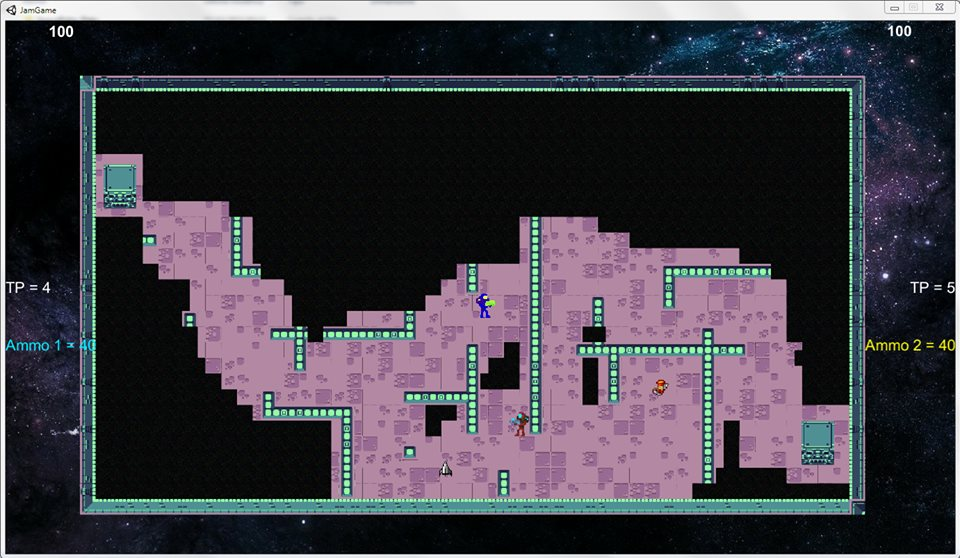

Description
===========

This is a game developed in 40 hours, by me and my friend [Gabriele Cristaudo](https://github.com/gcristaudo) during a game jam in Pisa at the Internet Festival 2015. The theme of the game jam was "inside space/between space/outside space".

Inside the build folder you can find the .exe file to try the game. The game is built for windows only, but you can open the project in Unity and build it for your desired platform.

Player 1:
========= 
- "wasd": movement
- "space bar": shot
- "e": create an invisible portal
- "q": teleport to the invisible portal

Player 2:
=========== 
- "arrows": movement
- "left click": shot
- "middle click": create an invisible portal
- "right click": teleport to the invisible portal

Bonus powerups:
=============== 
- boot: speed increase
- rockets: +5 ammos.
- 10 max TPs.
- The rockets direction is based on the player movement direction, the default direction is down.
- The goal of the game is to destroy the enemy relic.
To close the game simply press alt+f4 on windows.